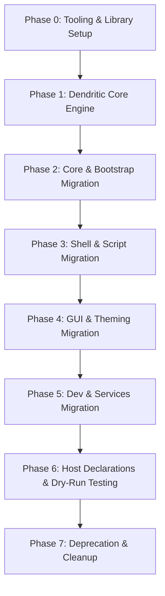

# Dendritic Pattern Migration Plan

This document outlines the end-to-end migration strategy for transitioning this NixOS configuration to the **dendritic pattern**.

---

## 1. Executive Summary & Objectives

The goal is to transition the current matrix-based configuration into an organic, tree-structured codebase.

### Primary Goals
1. **Eliminate the Settings Matrix**: Remove the 80+ boolean toggles in `settings.nix` and the manual mappings in `modules/nixos/default.nix` and `modules/home/default.nix`.
2. **Unify System & User Concerns**: Group system packages, background daemons, and user dotfiles for a given feature under a single module path.
3. **Automate Discovery & Inputs**:
   - Utilize `denful/import-tree` to automatically discover modules in `./modules/*`.
   - Utilize `denful/flake-file` to co-locate input declarations alongside their features and auto-generate `flake.nix`.
4. **Hierarchical Activation**: Provide flexible tree activation syntax (e.g., `gui.brave.enabled = true;` or selective child enablement `gui.brave = { core = true; apps.office = true; };`).
5. **Zero Disruption & Non-Destructive Validation**: Ensure each phase can be tested for syntax and evaluated with dry runs without touching host state.

---

## 2. Target Architecture & Library Stack

| Component | Technology | Role |
| :--- | :--- | :--- |
| **Top-Level Framework** | `flake-parts` + `import-tree` | Evaluates all modules recursively from `./modules/` without manual imports. |
| **Input Management** | `denful/flake-file` | Aggregates flake inputs declared inside modules and writes `flake.nix`. |
| **Node Engine** | `lib/dendritic.nix` | Implements `mkDendriticNode`, boolean coercion (`types.coercedTo`), and cascading inheritance. |
| **Dispatcher** | Dendritic Dispatcher | Automatically routes `nixos` submodules to NixOS system evaluations and `home-manager` submodules to the primary user profile. |

---

## 3. Phased Migration Roadmap



---

### Phase 0: Tooling & Library Setup
- **Tasks**:
  1. **Scaffolding Tooling (`./mkmodule`)**:
     Create the root `./mkmodule` executable helper script to accelerate incremental migration.
     - **Usage**: `./mkmodule <feature-path>` (e.g. `./mkmodule features.gui.apps.brave` or `./mkmodule gui.apps.brave`).
     - **Behavior**:
       - Automatically normalizes the path by stripping any leading `features.` or `config.features.`.
       - Translates the path into the target filepath under `modules/` (e.g., `gui.apps.brave` → `modules/gui/apps/brave/default.nix`).
       - Recursively creates any missing parent directories (`mkdir -p modules/gui/apps/brave`).
       - If intermediate folders do not have a `default.nix`, optionally scaffolds an interim orchestrator.
       - Generates a valid, minimal dendritic boilerplate:
         ```nix
         { config, lib, pkgs, inputs, ... }:
         let
           cfg = config.features.gui.apps.brave;
         in
         {
           options.features.gui.apps.brave = {
             enable = lib.mkOption {
               type = lib.types.bool;
               default = if config.features.gui.apps.enable then true else false;
             };
           };

           config = lib.mkIf cfg.enable {
             # nixos system and/or home-manager user configuration
           };
         }
         ```
       - Prints the absolute or relative path of the newly created file to `stdout` for direct editor/agent consumption (e.g. `modules/gui/apps/brave/default.nix`).
  2. Add `flake-file`, `import-tree`, and `flake-parts` inputs to the configuration.
  3. Create `flake-file.nix` (or root flake template) configured to run `inputs.import-tree ./modules`.
  4. Validate that `nix run .#write-flake` successfully builds and formats `flake.nix`.
- **Verification**:
  - Test `./mkmodule` on a temporary path, check output path and syntax with `nix-instantiate --parse`.
  - Run `nix run .#write-flake -- --check` to confirm no drift.

---

### Phase 1: Dendritic Core Engine & Schema Definition
- **Tasks**:
  1. Create `lib/dendritic.nix` and `lib/node.nix` containing:
     - `mkDendriticNode`: Custom type constructor supporting:
       - Boolean coercion (`types.coercedTo types.bool`): allows setting entire branch via `= true;` or selective attrset.
       - Alias support (`enabled` ↔ `enable`).
       - Strict Parent Gating: If `parent.enable == false`, all child submodules are unconditionally `false`.
       - Canonical Defaulting: If `parent.enable == true`, child submodules resolve to their **canonical default values as specified in `config-full.nix`**.
     - Collector / Dispatcher module: Traverses `config.features`, collects active `nixos` and `home-manager` deferred modules, and injects them into the evaluation pipeline.
  2. Implement unit tests in `proto/test-eval.nix` to verify parent-gating, canonical defaults, and explicit overrides.
- **Verification**: `nix-instantiate --eval proto/test-eval.nix` passes with expected values.

---

### Phase 2: Core & Bootstrap Migration
- **Target Modules**:
  - `nix.nix` → `modules/core/nix.nix`
  - `users.nix` + `modules/home/user.nix` → `modules/core/users/cloudburst.nix`
  - `locale.nix` → `modules/core/locale.nix`
  - `zram.nix`, `ldfix.nix` → `modules/core/system.nix`
  - `main.nix` → `modules/core/base.nix`
- **Actions**:
  - Co-locate user account creation (passwords, groups, SSH keys) with Home Manager dotfile links.
  - Set up `core.enable = true` by default in host profiles.
- **Verification**: Evaluate `nixosConfigurations.cloudburst-desktop.config.system.build.toplevel` in dry-run mode for core modules.

---

### Phase 3: Shell, Terminal & Scripts Migration
- **Target Modules**:
  - `modules/nixos/nushell.nix` + `modules/home/nushell/*` → `modules/shell/nushell/`
    - Co-locate helper scripts (`_plot.py`, `_pd.py`, `_gridview.py`) and submodules (`undo.nix`, `wrappers.nix`, `modules.nix`).
  - `modules/home/starship.nix` → `modules/shell/starship.nix`
  - `modules/home/ranger/*` → `modules/shell/ranger/`
  - `modules/home/git.nix` → `modules/shell/git.nix`
  - `modules/nixos/scripts/*` → `modules/shell/scripts/`
    - Split into category folders strictly mirroring `config-full.nix`:
      - `media/`: `default.nix`, `_icat.sh`, `_palette.sh`, `_video8mb.py`, `_datauri.sh`
      - `dev/`: `default.nix`, `_gh-origin-mod.sh`, `_nix-py.sh`, `_nx.sh`, `_sarif-md.py`
      - `hardware/`: `default.nix`, `_serial.sh`, `_extract.sh`, `_www.py`, `_rofi.sh`, `_auto-rotate.sh`, `_desktop-kickoff.sh`, `_weylus-screen.sh`
      - `documents/`: `default.nix`, `_beamer-clean.py`, `_ics-merge.py`, `_gcode-bounds.py`
  - `modules/shell/utils/`:
    - Split into `modern-cli.nix`, `fun.nix`, `nettools.nix`.
- **Actions**:
  - Expose custom shell scripts as packages under `pkgs` and ensure they hook into Nushell environment when enabled.
  - Prefix non-Nix scripts with `_` to prevent `import-tree` evaluation errors.
- **Verification**: Check syntax with `nix-instantiate --parse`.

---

### Phase 4: GUI, Desktop Environments, Theming & Workstation Dev Stack
- **Target Modules**:
  - `modules/nixos/theme.nix` + Stylix → `modules/gui/theme/`
    - Subdivided into `core.nix` (Stylix settings), `wallpaper.nix` (co-located image), and `font.nix`.
  - `modules/nixos/driftwm.nix` + `modules/home/driftwm/*` → `modules/gui/desktop/driftwm/`
    - Co-locate `_wallpaper.glsl` and `desktop.nix` (driftwm-desktop session package).
    - Nest Noctalia bar as `modules/gui/desktop/driftwm/noctalia.nix`.
  - `modules/nixos/plasma.nix` + `modules/home/plasma.nix` → `modules/gui/desktop/plasma.nix`.
  - `modules/nixos/greetd.nix` → `modules/gui/greeter/greetd.nix`.
  - `modules/nixos/brave/default.nix` + `apps.nix` → `modules/gui/apps/brave/`
    - `core.nix`: Main browser, enterprise policies, mime associations.
    - `apps/office.nix`: Office webapps.
    - `apps/media.nix`: Media webapps.
    - `apps/tools.nix`: Utility webapps.
  - `modules/gui/apps/editors/`:
    - `office.nix`: LibreOffice & PDF tooling (pdfgrep, pandoc, karp).
    - `vscode.nix`: VS Code & extension management.
    - `jetbrains.nix`: JetBrains IDEs (dynamically enables IDEs like RustRover or IntelliJ when corresponding `gui.dev.programming.*` languages are active).
  - `modules/gui/apps/tools/`:
    - `dolphin/`, `konsole/`, `obs.nix`, `social.nix`, `associations.nix`.
  - `modules/gui/dev/`:
    - `programming/`: Granular `rust.nix`, `go.nix`, `node.nix`, `kotlin.nix`.
    - `python.nix`: Data science, AI/CUDA, and script utility stacks.
    - `arduino.nix`: Arduino IDE, board udev rules.
    - `documents/`: `latex.nix`, `typst.nix`.
    - `threed.nix`: Blender, OrcaSlicer, FreeCAD, OpenSCAD libraries.
    - `android.nix`: Android platform tools, scrcpy, Android Studio & emulator.
- **Actions**:
  - Move template files (`.j2`, `.glsl`, `.xml`) with `_` prefix so `import-tree` ignores them.
  - Jinja2 template rendering helper centralized in `lib/helpers/jinja.nix`.
- **Verification**: Dry-run desktop build and syntax check.

---

### Phase 5: Compatibility Layers, Background Services & Server Daemons
- **Target Modules**:
  - **Compatibility (`modules/compat/`)**:
    - `wine/`: Wine compatibility layer with co-located `_theme.reg.j2`.
    - `distrobox.nix`: Distrobox container wrapper.
    - `waydroid.nix`: Waydroid Android container execution.
    - `podman.nix`: Rootless Podman daemon with docker CLI compatibility.
    - `kvm.nix`: QEMU / KVM virtualization & virt-manager.
  - **Background Services (`modules/services/`)**:
    - `tailscale.nix`: Tailscale mesh VPN daemon & exit-node controls.
    - `openssh.nix`: OpenSSH daemon with password authentication toggle.
    - `waypipe.nix`: Remote Wayland application streaming.
    - `weylus.nix`: Tablet touchscreen mirror & stylus input.
    - `usbip.nix`: USB-over-IP daemon.
  - **Server Daemons (`modules/server/`)**:
    - `samba.nix`: Declarative Samba shares configured by paths list.
    - `weston-rdp.nix`: Weston RDP server.
- **Verification**: Ensure optional flags and service endpoints are cleanly passed via dendritic node options without warnings.

---

### Phase 6: Host Declarations & Dry-Run Testing
- **Target Hosts**:
  - `hosts/cloudburst-desktop`
  - `hosts/cloudburst-laptop`
  - `hosts/cloudburst-tablet`
  - `hosts/bootstrap`
- **Actions**:
  - For each host, adopt the standard 4-file layout with a declarative `features.nix` specifying the activated feature nodes.
  - Hardware configurations and filesystems remain host-specific imports.
- **Verification**: Run `nixos-rebuild dry-run --flake .#<host>` for each machine.

---

### Phase 7: Deprecation & Cleanup
- Remove legacy `modules/nixos/` and `modules/home/` directories.
- Remove old `settings.nix` from all host folders.
- Run `alejandra .` to format the entire repository.
- Commit changes under descriptive git commit.

---

## 4. Risk Mitigation & Fallback Strategy

1. **Incremental Side-by-Side Validation**:
   Keep legacy `nixosConfigurations` accessible during the transition (e.g. `nixosConfigurations.cloudburst-desktop-dendritic`) to compare closure sizes and derivations before replacing the default target.
2. **Dry-Run Enforcement**:
   No configuration will be applied to the running system during development. Only dry-run commands and pure Nix evaluations will be executed.
3. **Flake Lock Preservation**:
   All pinned input revisions from `flake.lock` will be preserved when transitioning inputs to `flake-file`.
